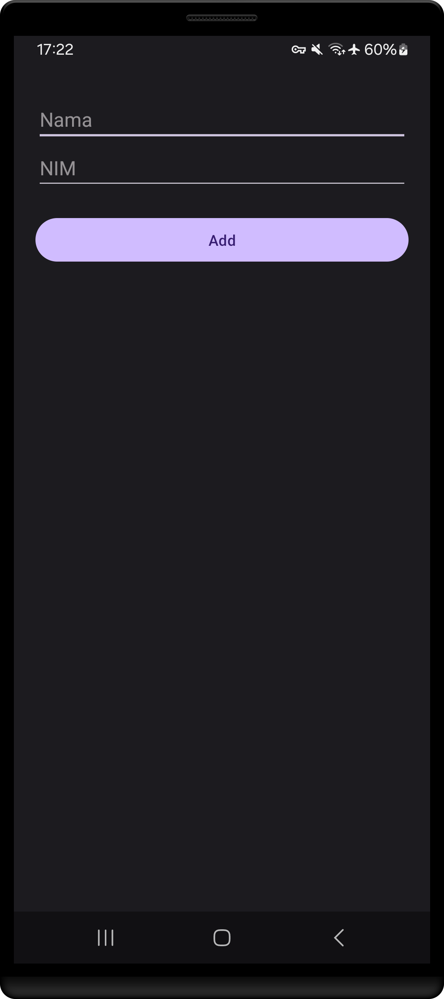
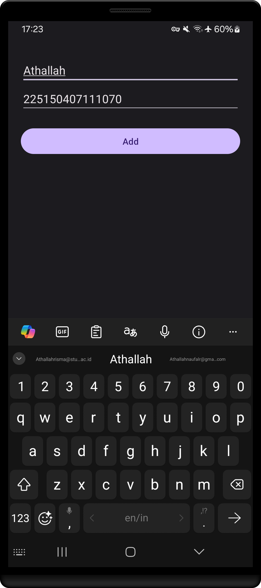
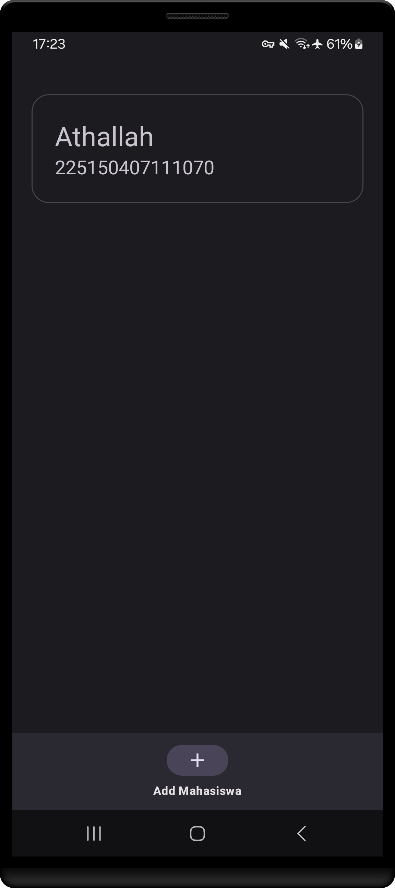
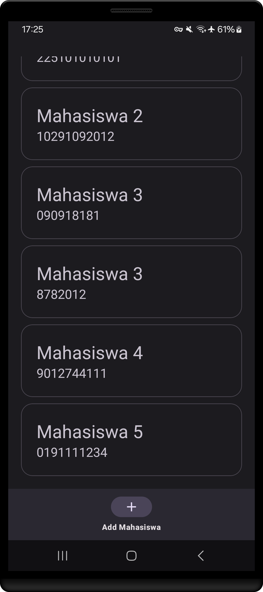
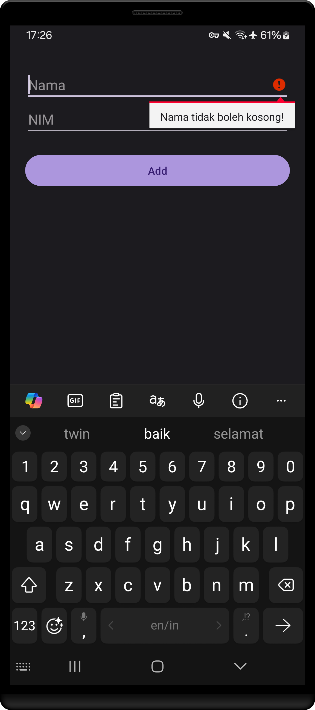
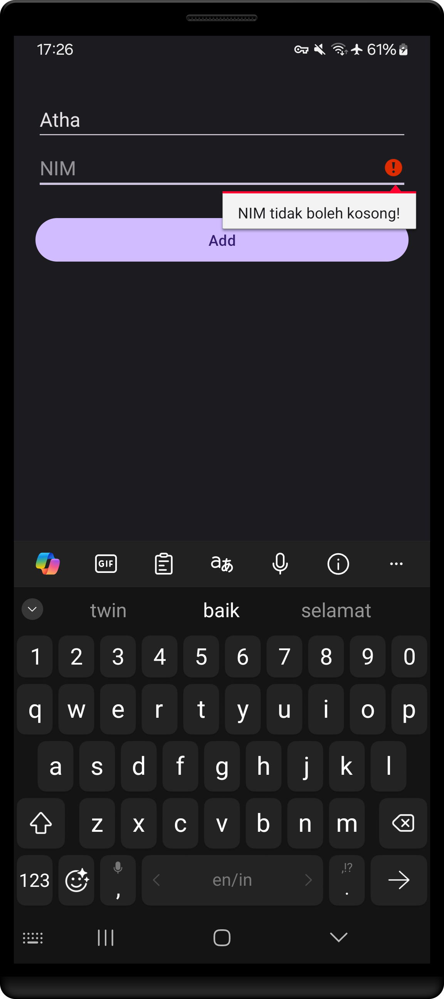

# Tugas 5 PAM - Daftar Mahasiswa dengan RecyclerView dan Penambahan Data pada Room
<table>
    <tr>
        <td></td>
        <td></td>
        <td></td>
        <td></td>
    </tr>
    <tr>
        <td></td>
        <td></td>
        <td></td>
    </tr>
</table>